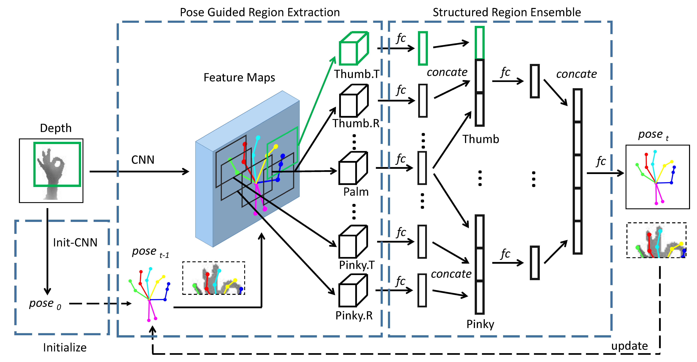

## Pose Guided Structured Region Ensemble Network for Cascaded Hand Pose Estimation

By Xinghao Chen, Guijin Wang, Hengkai Guo, Cairong Zhang, Tsinghua University.

[\[arXiv\]](https://arxiv.org/abs/1708.03416)&nbsp;&nbsp;&nbsp;&nbsp;[\[Project Page\]](https://sites.google.com/view/xinghaochen/projects/Pose-REN)

&nbsp;&nbsp;&nbsp;&nbsp;&nbsp;&nbsp;&nbsp;&nbsp;

<sup>\* Demos above are realtime results from Intel Realsense SR300 using models trained on [Hands17](http://icvl.ee.ic.ac.uk/hands17/challenge/) dataset. </sup></br>
<sup>\* See more demos using pre-trained models on ICVL, NYU and MSRA in [``src/demo``](./src/demo).</sup>

### Introduction
This repository contains the demo code for [Pose-REN](https://arxiv.org/abs/1708.03416), an accurate and fast method for depth-based 3D hand pose estimation.


<div align=center>
Figure 1: Framework of Pose-REN.
</div>

### Citation
If you find our work useful in your research, please consider citing:

    @article{chen2018pose,
      title={Pose Guided Structured Region Ensemble Network for Cascaded Hand Pose Estimation},
      author={Chen, Xinghao and Wang, Guijin and Guo, Hengkai and Zhang, Cairong},
      journal={Neurocomputing},
      year={2018}
    }

### Requirements
- [caffe-pose](https://github.com/xinghaochen/caffe-pose)
- OpenCV (with python interface)
- Optional: [librealsense](https://github.com/IntelRealSense/librealsense) (for live demo only)

### Installation
Clone [caffe-pose](https://github.com/xinghaochen/caffe-pose):
```
git clone https://github.com/xinghaochen/caffe-pose.git
```

Install caffe:
```
cd caffe-pose
cp Makefile.config.example Makefile.config
# uncomment WITH_PYTHON_LAYER := 1
# change other settings accordingly
make -j16
make pycaffe -j16
```
Add `path/to/caffe-pose/python` to PYTHONPATH.

We use a new layer called GenerateROILayer in Pose-REN and the python and c++ implementations are located in `src/libs`.

If you prefer using python layer, add `path/to/src/libs` to PYTHONPATH, otherwise copy `generate_roi_layer.hpp/cpp` to `caffe-pose`, update `caffe.proto` with the provided patch `caffe.patch.proto` and build caffe again.

### Results & Models

The tables below show the predicted labels and pretrained models on ICVL, NYU and MSRA dataset. All labels are in the format of (u, v, d) where u and v are pixel coordinates.

| Dataset | Predicted Labels | Models|
|-------|-------|-------|
| ICVL | [Download](./results/NEUCOM18_ICVL_Pose_REN.txt) | [\[Google Drive\]](https://drive.google.com/open?id=1uo5e7q7LIamkb9-nLdkbckBEmYRd3sn8) or [\[Baidu Cloud\]](https://pan.baidu.com/s/1-sy7dUlZyQ2mkp10z-QUug) |
| NYU | [Download](./results/NEUCOM18_NYU_Pose_REN.txt) | [\[Google Drive\]](https://drive.google.com/open?id=14RJPi_V6R-G3tQRwgKtUtRTc7Kb27KmC) or [\[Baidu Cloud\]](https://pan.baidu.com/s/1bDMxhhTdcKq2qfE1nkLY_g)  |
| MSRA | [Download](./results/NEUCOM18_MSRA_Pose_REN.txt) | [\[Google Drive\]](https://drive.google.com/open?id=18mKhUcg5eUOvs4KoHuNYLTVPJR5O99Or) or [\[Baidu Cloud\]](https://pan.baidu.com/s/1FzTZkO3JXMCW4Ri-_QEt3Q)  |
| [HANDS17](http://icvl.ee.ic.ac.uk/hands17/challenge/) | - | [\[Google Drive\]](https://drive.google.com/open?id=1ItFHQDCyFwQYqqoOYMXfHvwISKgP7BoN) or [\[Baidu Cloud\]](https://pan.baidu.com/s/1G8WkixAxG68YFAWP9Te4vw)  |

### Visualization

Please use the Python script `src/show_result.py` to visualize the predicted results:
``` bash
$ python src/show_result.py icvl your/path/to/ICVL/test/Depth --in_file=results/NEUCOM18_ICVL_Pose_REN.txt
```
You can see all the testing results on the images. Press 'q' to exit.

### Inference & Evaluation
First copy and modify the example `config.py` for your setup. Please change `data_dir` and `anno_dir` accordingly.
``` bash
$ cp config.py.example config.py
```

Use the Python script `src/testing/predict.py` for prediction with predefined centers in `labels` directory:
``` bash
$ python src/testing/predict.py icvl your/path/to/output/file.txt
```
The script depends on pycaffe.

Please see [here](https://github.com/xinghaochen/awesome-hand-pose-estimation/tree/master/evaluation) for how to evaluate performance of hand pose estimation.

### Realsense Realtime Demo
We provide a realtime hand pose estimation demo using Intel Realsense device.
Note that we just use a naive depth thresholding method to detect the hand. Therefore, the hand should be in the range of [0, 650mm] to run this demo.
We tested this realtime demo with an [Intel Realsense SR300](https://software.intel.com/en-us/realsense/sr300camera).

**Please use your right hand for this demo and try to avoid clustered foreground and redundant arm around the hand.**

#### Python demo with [librealsense](https://github.com/IntelRealSense/librealsense) [recommended]
First compile and install the [librealsense](https://github.com/IntelRealSense/librealsense) and its [python wrapper](https://github.com/IntelRealSense/librealsense/tree/5285629b4ddb374f1). After everything is working properly, just run the following python script for demo:
``` bash
python src/demo/realsense_realtime_demo_librealsense2.py
```

By default this script uses pre-trained weights on ICVL dataset. You can change the pre-trained model by specifying the dataset.
``` bash
python src/demo/realsense_realtime_demo_librealsense2.py  nyu/msra/icvl
```

Notes: The speed of this python demo is not optimal and it runs slightly slower than the c++ demo.

#### C++ demo

First compile and build:

```
cd src/demo/pose-ren-demo-cpp
mkdir build
cd build
cmake ..
make -j16
```
Run the demo by:
```
cd ..                 # redirect to src/demo/pose-ren-demo-cpp
./build/src/PoseREN   # run
```

By default it uses pre-trained weights on Hands17 dataset. You can change the pre-trained model by specifying the dataset.
``` bash
./build/src/PoseREN  nyu/msra/icvl
```

Notes: This C++ demo is not fully developed and you may have to deal with some dependency problems to make it works. It servers as a preliminary project to demonstrate how to use Pose-REN in C++.

### License
Our code and pre-trained models are available for non-commercial research purposes only.

### Contact
chenxinghaothu at gmail.com
